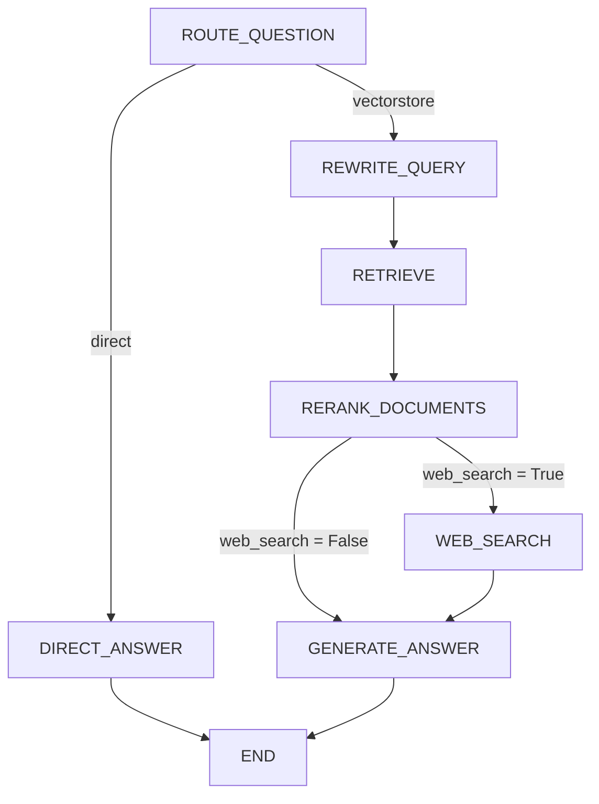

# Arhitektura sistema

## CRAG tok rada (LangGraph)

Nazivi čvorova su konstante iz [rag/constants.py](../rag/constants.py) i pojavljuju se doslovno u
LangGraph `astream_events` izlazu koji API sloj prosljeđuje frontend-u kao "stage" evente.

- `ROUTE_QUESTION` (`rag/graph.py: _route_question`) koristi `question_router_chain` da odluči da li
  pitanje zahtijeva dohvat iz baze znanja ili se može odgovoriti direktno (npr. pozdravi).
- `RERANK_DOCUMENTS` postavlja `state["web_search"] = True` kada nakon cross-encoder rangiranja nema
  dovoljno dokumenata iznad praga relevantnosti (`RERANKER_SCORE_THRESHOLD` u
  [rag/constants.py](../rag/constants.py)) — ovo je "korektivni" (corrective) korak CRAG arhitekture.
- `GENERATE_ANSWER` i `DIRECT_ANSWER` su jedini čvorovi koji streamuju LLM tokene korisniku.

## Mapiranje funkcionalnih zahtjeva na kod

| Funkcionalni zahtjev | Implementacija |
|---|---|
| Upload i ekstrakcija teksta iz dokumenata | [ingestion.py](../ingestion.py), `POST /documents/upload` u [api/main.py](../api/main.py) |
| Integracija sa vektorskom bazom | [retrieval/vectorstore.py](../retrieval/vectorstore.py) |
| Evaluacija relevantnosti dohvaćenih dokumenata | [rag/reranker.py](../rag/reranker.py), [rag/nodes/rerank_documents.py](../rag/nodes/rerank_documents.py) |
| Mehanizam odlučivanja o proširenju znanja | `_decide_to_generate()` u [rag/graph.py](../rag/graph.py) |
| Dinamičko proširenje znanja pretragom interneta | [rag/nodes/web_search.py](../rag/nodes/web_search.py) |
| Generisanje odgovora uz pomoć LLM-a | [rag/chains/generation.py](../rag/chains/generation.py), [rag/nodes/generate.py](../rag/nodes/generate.py), [rag/nodes/direct_answer.py](../rag/nodes/direct_answer.py) |
| Korisničko sučelje | [ui/app.py](../ui/app.py) |

## Stanje grafa (`GraphState`)

Definisano u [rag/state.py](../rag/state.py) kao `TypedDict` koje teče kroz sve čvorove:

| Polje | Opis |
|---|---|
| `question` | Pitanje korisnika (moguće preformulisano radi boljeg dohvata) |
| `original_question` | Originalno pitanje prije preformulisanja |
| `generation` | Konačan odgovor generisan od strane LLM-a |
| `web_search` | Da li je potreban korak pretrage interneta |
| `documents` | Dohvaćeni dokumenti (iz vektorske baze ili web pretrage) |
| `relevance_ratio` | Udio dokumenata ocijenjenih kao relevantni nakon rangiranja |
| `sources` | Deduplicirane reference izvora izvučene iz dokumenata |
| `chat_history` | Prethodni koraci razgovora radi konteksta u više koraka |

## Lokalno stanje i baze

Aplikacija koristi dva lokalna SQLite skladišta:
- [api/document_registry.py](../api/document_registry.py) — bilježi metapodatke o ingestovanim dokumentima, uključujući broj chunk-ova i Pinecone vector ID-jeve, kako bi se dokumenti mogli kasnije ukloniti u potpunosti.
- [ui/chat_store.py](../ui/chat_store.py) — čuva razgovore i poruke u lokalnoj bazi za Streamlit interfejs.

Datoteke u [data/](../data/) se automatski kreiraju pri prvom pokretanju. Raw upload fajlovi nisu trajno pohranjeni: nakon ingestovanja ostaju samo privremeno na disku dok se tekst ne ekstrahuje i ne upiše u vektorsku bazu.

## Direktoriji

- `api/` — FastAPI REST sloj (SSE streaming `/chat`, CRUD za `/documents`).
- `rag/` — CRAG logika, LangGraph orkestracija (`graph.py`, `state.py`, `chains/`, `nodes/`, `models/`).
- `retrieval/` — Pinecone vektorska baza, konfiguracija pragova i modela.
- `ui/` — Streamlit korisničko sučelje i lokalna SQLite historija razgovora.
- `ingestion.py` — pipeline za učitavanje, chunkanje i upsertovanje dokumenata u Pinecone.
- `evaluation/` — golden Q&A skup i LangSmith evaluacijska skripta za ocjenu tačnosti odgovora.
